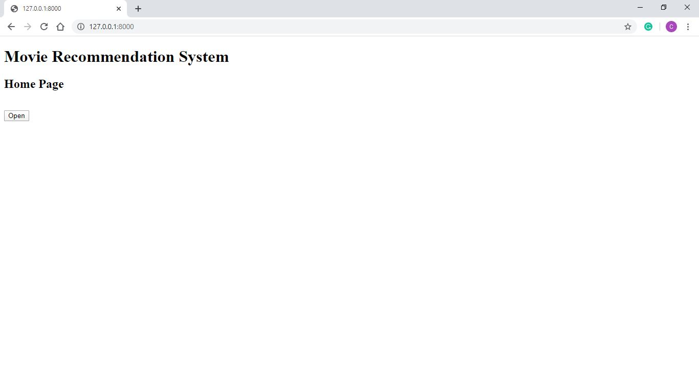
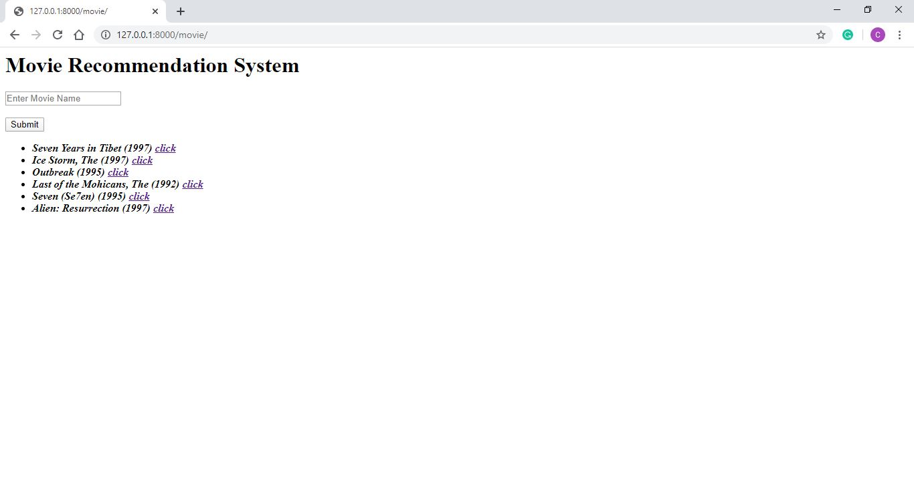
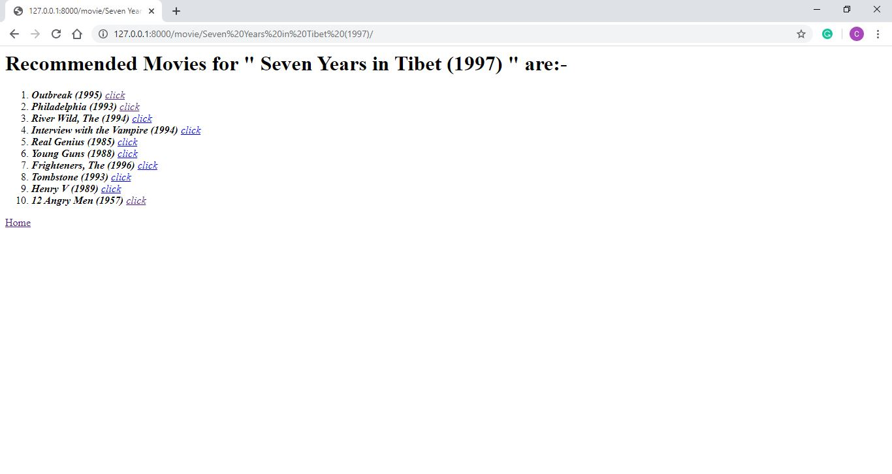

# Movie-Recommendation-System

Here, I have some data user's who gave ratings to some of the popular movies and after based on user activity when ever a user see a movie he gets recommended with some movies which are closely or very much belongs to that movie.

Now I will deploy this project on the Web Server where you just enter a movie name and based on previous user activities the system will recommend you some mpovies.

Here, I deploy the project of Recommendation System on the WebServer.
Now the only part left is to make the UI i.e html templates to make it more attaractive to a User.

## 
.

## 
.

## 
.
